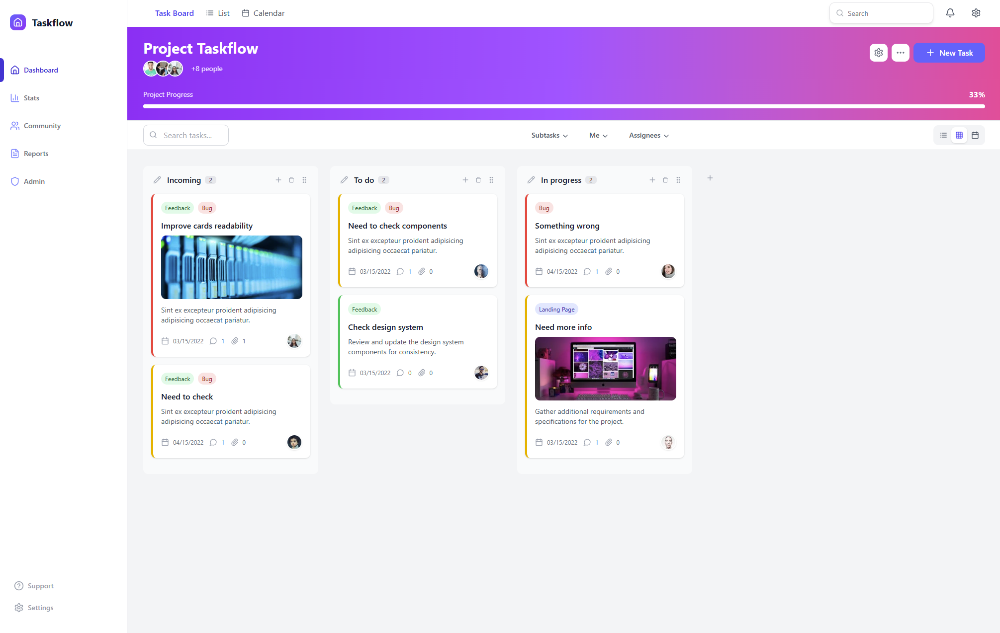

# 🚀 TaskFlow – Project Management Made Simple

> A sleek, feature-rich task management application inspired by tools like Jira and Asana. Built with **React 19**, **Vite**, and powered by **useReducer** for scalable state management and **[shadcn/ui](https://ui.shadcn.com/)** components.

---



## 📌 What is TaskFlow?

**TaskFlow** is a fully-featured task management application designed for organizing work across customizable boards and columns — perfect for teams and individuals who need flexibility without complexity.

With a powerful `useReducer`-based state system, TaskFlow enables users to:

- ✅ Create, rename, and remove **custom columns** (like "To Do", "In Progress", etc.)
- 📌 Add, edit, delete, and **reorder tasks** seamlessly
- 🔀 Drag and drop tasks between columns or within a column to re-prioritize
- 🔍 Search and **filter tasks** in real-time
- 💬 Add, edit, and delete **comments** on tasks for collaboration
- 🔄 Reset or restore tasks to their original state
- 🎯 Reorder entire **column layouts** to match your workflow

All of this functionality is built with **scalable state logic**, making it easy to maintain and extend as your app grows. Whether you're managing sprints like Jira or planning projects like Asana, TaskFlow gives you the tools to stay organized — your way.

---

## 🌟 Features

- 🧱 Drag-and-drop task boards (powered by `@dnd-kit`)
- 📅 Date pickers & scheduling with `react-day-picker`
- ⚙️ Custom UI built using **headless Radix UI components**
- 💡 Command palette support via `cmdk`
- 🎨 Fully customizable with Tailwind CSS
- 🔍 Type-safe with TypeScript
- 🛠️ Efficient state logic using `useReducer` (no external state managers)
- 🌘 Light/dark mode toggle and responsive design

---

## 🛠 Tech Stack

| Layer         | Technology                      |
| ------------- | ------------------------------- |
| Framework     | React 19 + Vite                 |
| State Mgmt    | React `useReducer`              |
| UI Components | shadcn/ui (Radix UI + Tailwind) |
| Styling       | Tailwind CSS                    |
| Linting       | ESLint + TypeScript ESLint      |
| Animation     | TailwindCSS Animate             |

---

## 🧪 Development Tools

- **TypeScript**: For type safety
- **ESLint**: Code linting & quality
- **Vite Plugin React**: Seamless React integration
- **Vite TSConfig Paths**: Absolute imports support

---

## 📁 Project Structure (Simplified)

```bash
src/
├── components/       # Reusable UI components (shadcn/ui styled)
├── hooks/            # Custom hooks (e.g., useTasks, useBoard)
├── lib/              # Utility functions and constants
├── reducer/          # Reducer logic using useReducer
├── types/            # TypeScript interfaces and types
├── views/            # Dashboard views
├── app.tsx           # Main component tree
└── main.tsx          # Entry point
```

---

## 🚀 Getting Started

Follow these steps to get your development environment set up.

### Prerequisites

Make sure you have Bun installed on your system.

```bash
curl -fsSL https://bun.sh/install | bash
```

### 📦 Installation

1. Clone the repository (or create a new project from this template):

If you're creating a new project from scratch, you can use Vite directly:

```bash
git clone https://github.com/radinax/project-management.git
cd project-management
```

2. Install dependencies:

Bun will install all the necessary project dependencies:

```bash
bun install
```

3. Running the Development Server

Start the development server with Vite:

```bash
bun run dev
```

This will typically open your application at http://localhost:5173. The development server supports hot module replacement (HMR) for a fast development loop.

---

## 📦 Deployment

## After running bun build, the optimized production assets will be located in the dist/ directory. You can deploy this directory to any static site hosting service (e.g., Netlify, Vercel, GitHub Pages, Firebase Hosting).

## 🤝 Contributing

Contributions are welcome! Please feel free to open issues or submit pull requests.

## 📄 License

This project is open-sourced under the MIT License.

---

**Built with ❤️ by [Adrian Beria](https://github.com/Radinax)**
